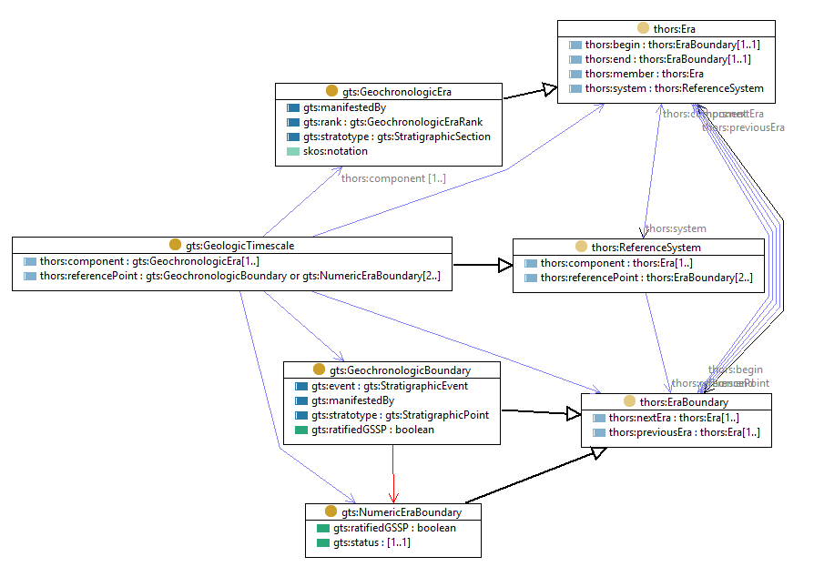

# Geologic Timescale model
Markdown documentation created by [pyLODE](http://github.com/rdflib/pyLODE)

## Metadata
* **IRI**
  * `http://resource.geosciml.org/ontology/timescale/gts`
* **Creators(s)**
  * <a href='https://orcid.org/0000-0002-3884-3420'>Simon Jonathan David COX, CSIRO Australia</a>
* **Contributor(s)**
  * <a href='https://orcid.org/0000-0001-6041-5302'>Stephen M RICHARD</a>
* **Created**
  * 2011-01-01
* **Modified**
  * 2017-04-28
* **Imports**
  * <a href="http://resource.geosciml.org/ontology/timescale/thors">http://resource.geosciml.org/ontology/timescale/thors</a>
* **License &amp; Rights**
  * <a href="http://creativecommons.org/licenses/by/4.0/">http://creativecommons.org/licenses/by/4.0/</a>
  * &copy; © 2012-2017 CSIRO
* **Ontology Source**
  * <a href="./rdf/gts.ttl">RDF (turtle)</a>
* **Code Repository**
  * <https://github.com/CGI-IUGS/timescale-ont>
### Description

This is an RDF/OWL representation of the GeoSciML Geologic Timescale model, which has been adapted from the model described in <a href='https://doi.org/10.1130/GES00022.1
'>Cox, S.J.D, &amp; Richard, S.M. (2005) A formal model for the geologic timescale and GSSP, compatible with geospatial information transfer standards, Geosphere, Geological Society of America 1/3, 119–137</a>.

This ontology (GTS) imports and specializes a generic ontology for Temporal Hierarchical Ordinal Reference System (THORS). 

It is recommended that the W3C OWL-Time ontology is used to encode details of temporal positions, and also to record temporal relationships between eras/intervals.

## Table of Contents
1. [Classes](#classes)
1. [Object Properties](#objectproperties)
1. [Datatype Properties](#datatypeproperties)
1. [Namespaces](#namespaces)  

## Overview

**Figure 1:** Ontology overview  
## Classes
[Age](#Age),
[Eon](#Eon),
[Epoch](#Epoch),
[Era](#Era),
[Geochronologic Boundary](#GeochronologicBoundary),
[Geochronologic Era](#GeochronologicEra),
[Geochronologic Era Rank](#GeochronologicEraRank),
[Geologic Timescale](#GeologicTimescale),
[Numeric Era Boundary](#NumericEraBoundary),
[Period](#Period),
[Stratigraphic Event](#StratigraphicEvent),
[Stratigraphic Point](#StratigraphicPoint),
[Stratigraphic Section](#StratigraphicSection),
[Sub-Period](#Sub-Period),
[Super-Eon](#Super-Eon),
### Age c
Property | Value
--- | ---
IRI | `http://resource.geosciml.org/ontology/timescale/gts#Age`
Super-classes |<a href="#GeochronologicEra">gts:GeochronologicEra</a>c 
### Eon c
Property | Value
--- | ---
IRI | `http://resource.geosciml.org/ontology/timescale/gts#Eon`
Super-classes |<a href="#GeochronologicEra">gts:GeochronologicEra</a>c 
### Epoch c
Property | Value
--- | ---
IRI | `http://resource.geosciml.org/ontology/timescale/gts#Epoch`
Super-classes |<a href="#GeochronologicEra">gts:GeochronologicEra</a>c 
### Era c
Property | Value
--- | ---
IRI | `http://resource.geosciml.org/ontology/timescale/gts#Era`
Super-classes |<a href="#GeochronologicEra">gts:GeochronologicEra</a>c 
### Geochronologic Boundary c
Property | Value
--- | ---
IRI | `http://resource.geosciml.org/ontology/timescale/gts#GeochronologicBoundary`
Super-classes |<a href="http://resource.geosciml.org/ontology/timescale/thors#EraBoundary">thors:EraBoundary</a>c 
Restrictions |<a href="#stratotype">gts:stratotype</a>op only <a href="#StratigraphicPoint">gts:StratigraphicPoint</a>c 
In range of |<a href="#geochronologicboundary">gts:boundary</a>op 
### Geochronologic Era c
Property | Value
--- | ---
IRI | `http://resource.geosciml.org/ontology/timescale/gts#GeochronologicEra`
Super-classes |<a href="http://resource.geosciml.org/ontology/timescale/thors#Era">thors:Era</a>c 
Restrictions |<a href="http://www.w3.org/2004/02/skos/core#notation">skos:notation</a> some <a href="http://resource.geosciml.org/ontology/timescale/gts#EraCode">gts:EraCode</a>c <a href="#stratotype">gts:stratotype</a>op only <a href="#StratigraphicSection">gts:StratigraphicSection</a>c 
Sub-classes |<a href="#Age">gts:Age</a>c <a href="#Era">gts:Era</a>c <a href="#Epoch">gts:Epoch</a>c <a href="#Period">gts:Period</a>c <a href="#Super-Eon">gts:Super-Eon</a>c <a href="#Sub-Period">gts:Sub-Period</a>c <a href="#Eon">gts:Eon</a>c 
In domain of |<a href="#Geochronologicerarank">gts:rank</a>op 
In range of |<a href="#geochronologicera">gts:era</a>op 
### Geochronologic Era Rank c
Property | Value
--- | ---
IRI | `http://resource.geosciml.org/ontology/timescale/gts#GeochronologicEraRank`
Super-classes |<a href="http://www.w3.org/2004/02/skos/core#Concept">skos:Concept</a>c 
In range of |<a href="#Geochronologicerarank">gts:rank</a>op 
### Geologic Timescale c
Property | Value
--- | ---
IRI | `http://resource.geosciml.org/ontology/timescale/gts#GeologicTimescale`
Super-classes |<a href="http://resource.geosciml.org/ontology/timescale/thors#ReferenceSystem">thors:ReferenceSystem</a>c 
Restrictions |<a href="http://resource.geosciml.org/ontology/timescale/thors#referencePoint">thors:referencePoint</a> only (<a href="#GeochronologicBoundary">gts:GeochronologicBoundary</a>c or <a href="#NumericEraBoundary">gts:NumericEraBoundary</a>c) <a href="http://resource.geosciml.org/ontology/timescale/thors#component">thors:component</a> only <a href="#GeochronologicEra">gts:GeochronologicEra</a>c 
### Numeric Era Boundary c
Property | Value
--- | ---
IRI | `http://resource.geosciml.org/ontology/timescale/gts#NumericEraBoundary`
Super-classes |<a href="http://resource.geosciml.org/ontology/timescale/thors#EraBoundary">thors:EraBoundary</a>c 
Restrictions |<a href="#status">gts:status</a>dp exactly 1 
### Period c
Property | Value
--- | ---
IRI | `http://resource.geosciml.org/ontology/timescale/gts#Period`
Super-classes |<a href="#GeochronologicEra">gts:GeochronologicEra</a>c 
### Stratigraphic Event c
Property | Value
--- | ---
IRI | `http://resource.geosciml.org/ontology/timescale/gts#StratigraphicEvent`
Description | A subclass of Geologic Event (placeholder) 
In range of |<a href="#stratigraphicevent">gts:event</a>op 
### Stratigraphic Point c
Property | Value
--- | ---
IRI | `http://resource.geosciml.org/ontology/timescale/gts#StratigraphicPoint`
Restrictions |<a href="#correlationevent">gts:correlationEvent</a>dp exactly 1 <a href="#ratified">gts:ratifiedGSSP</a>dp max 1 <a href="#status">gts:status</a>dp exactly 1 
In domain of |<a href="#correlationevent">gts:correlationEvent</a>dp <a href="#geochronologicboundary">gts:boundary</a>op <a href="#boundarylevel">gts:boundaryLevel</a>dp 
### Stratigraphic Section c
Property | Value
--- | ---
IRI | `http://resource.geosciml.org/ontology/timescale/gts#StratigraphicSection`
Restrictions |<a href="#geologicdescription">gts:geologicDescription</a>dp exactly 1 <a href="#geologicsetting">gts:geologicSetting</a>dp exactly 1 
In domain of |<a href="#geologicdescription">gts:geologicDescription</a>dp <a href="#geologicsetting">gts:geologicSetting</a>dp <a href="#geochronologicera">gts:era</a>op 
### Sub-Period c
Property | Value
--- | ---
IRI | `http://resource.geosciml.org/ontology/timescale/gts#Sub-Period`
Super-classes |<a href="#GeochronologicEra">gts:GeochronologicEra</a>c 
### Super-Eon c
Property | Value
--- | ---
IRI | `http://resource.geosciml.org/ontology/timescale/gts#Super-Eon`
Super-classes |<a href="#GeochronologicEra">gts:GeochronologicEra</a>c 

## Object Properties
[geochronologic boundary](geochronologicboundary),
[correlating boundary or era](correlatingboundaryorera),
[geochronologic era](geochronologicera),
[stratigraphic event](stratigraphicevent),
[geologic manifestation](geologicmanifestation),
[Uncertainty in time position](Uncertaintyintimeposition),
[Geochronologic era rank](Geochronologicerarank),
[stratotype](stratotype),

### geochronologic boundary op
Property | Value
--- | ---
IRI | `http://resource.geosciml.org/ontology/timescale/gts#boundary`
Description | geochronologic boundary corresponding with this point
Domain(s) |<a href="#StratigraphicPoint">gts:StratigraphicPoint</a>c 
Range(s) |<a href="#GeochronologicBoundary">gts:GeochronologicBoundary</a>c 

### correlating boundary or era op
Property | Value
--- | ---
IRI | `http://resource.geosciml.org/ontology/timescale/gts#correlatesWith`
Description | This property points from a geologic feature or event to a geochronologic element
Range(s) |<a href="#GeochronologicBoundary">gts:GeochronologicBoundary</a>c <a href="#GeochronologicEra">gts:GeochronologicEra</a>c 

### geochronologic era op
Property | Value
--- | ---
IRI | `http://resource.geosciml.org/ontology/timescale/gts#era`
Description | geochronologic era corresponding with this section
Domain(s) |<a href="#StratigraphicSection">gts:StratigraphicSection</a>c 
Range(s) |<a href="#GeochronologicEra">gts:GeochronologicEra</a>c 

### stratigraphic event op
Property | Value
--- | ---
IRI | `http://resource.geosciml.org/ontology/timescale/gts#event`
Description | stratigraphic event corresponding with this boundary or point
Domain(s) |(<a href="#GeochronologicBoundary">gts:GeochronologicBoundary</a>c or <a href="#StratigraphicPoint">gts:StratigraphicPoint</a>c) 
Range(s) |<a href="#StratigraphicEvent">gts:StratigraphicEvent</a>c 

### geologic manifestation op
Property | Value
--- | ---
IRI | `http://resource.geosciml.org/ontology/timescale/gts#manifestedBy`
Description | This property points from a geochronologic element to a geologic feature
Domain(s) |(<a href="#GeochronologicBoundary">gts:GeochronologicBoundary</a>c or <a href="#GeochronologicEra">gts:GeochronologicEra</a>c) 

### Uncertainty in time position op
Property | Value
--- | ---
IRI | `http://resource.geosciml.org/ontology/timescale/gts#positionalUncertainty`

### Geochronologic era rank op
Property | Value
--- | ---
IRI | `http://resource.geosciml.org/ontology/timescale/gts#rank`
Description | Elements of all ranks are included in the class 'gts:GeochronologicEra'. 
The rank may be indicated by membership of a sub-class, or is indicated using the 'gts:rank' property.
Domain(s) |<a href="#GeochronologicEra">gts:GeochronologicEra</a>c 
Range(s) |<a href="#GeochronologicEraRank">gts:GeochronologicEraRank</a>c 

### stratotype op
Property | Value
--- | ---
IRI | `http://resource.geosciml.org/ontology/timescale/gts#stratotype`
Description | the characteristic point or section corresponding with a geochronologic concept
Domain(s) |(<a href="#GeochronologicBoundary">gts:GeochronologicBoundary</a>c or <a href="#GeochronologicEra">gts:GeochronologicEra</a>c) 
Range(s) |<a href="#StratigraphicPoint">gts:StratigraphicPoint</a>c <a href="#StratigraphicSection">gts:StratigraphicSection</a>c 

## Datatype Properties
[boundary level](boundarylevel),
[correlation event](correlationevent),
[geologic description](geologicdescription),
[geologic setting](geologicsetting),
[ratified](ratified),
[status](status),

### boundary level dp
Property | Value
--- | ---
IRI | `http://resource.geosciml.org/ontology/timescale/gts#boundaryLevel`
Description | the level within the section of the point characterizing the boundary
Domain(s) |<a href="#StratigraphicPoint">gts:StratigraphicPoint</a>c 

### correlation event dp
Property | Value
--- | ---
IRI | `http://resource.geosciml.org/ontology/timescale/gts#correlationEvent`
Description | the stratigraphic event that is intended to be represented by this stratigraphic point
Domain(s) |<a href="#StratigraphicPoint">gts:StratigraphicPoint</a>c 

### geologic description dp
Property | Value
--- | ---
IRI | `http://resource.geosciml.org/ontology/timescale/gts#geologicDescription`
Domain(s) |<a href="#StratigraphicSection">gts:StratigraphicSection</a>c 

### geologic setting dp
Property | Value
--- | ---
IRI | `http://resource.geosciml.org/ontology/timescale/gts#geologicSetting`
Domain(s) |<a href="#StratigraphicSection">gts:StratigraphicSection</a>c 

### ratified dp
Property | Value
--- | ---
IRI | `http://resource.geosciml.org/ontology/timescale/gts#ratifiedGSSP`
Description | 'true' if ratified by ICS
Domain(s) |(<a href="#StratigraphicPoint">gts:StratigraphicPoint</a>c or <a href="#GeochronologicBoundary">gts:GeochronologicBoundary</a>c or <a href="#NumericEraBoundary">gts:NumericEraBoundary</a>c) 
Range(s) |<a href="http://www.w3.org/2001/XMLSchema#boolean">xsd:boolean</a>c 

### status dp
Property | Value
--- | ---
IRI | `http://resource.geosciml.org/ontology/timescale/gts#status`
Description | formal ICS status of this boundary and point
Domain(s) |(<a href="#NumericEraBoundary">gts:NumericEraBoundary</a>c or <a href="#StratigraphicPoint">gts:StratigraphicPoint</a>c) 

## Namespaces
* **default (:)**
  * `http://resource.geosciml.org/ontology/timescale/gts#`
* **dc**
  * `http://purl.org/dc/elements/1.1/`
* **dcterms**
  * `http://purl.org/dc/terms/`
* **doap**
  * `http://usefulinc.com/ns/doap#`
* **gts**
  * `http://resource.geosciml.org/ontology/timescale/gts#`
* **owl**
  * `http://www.w3.org/2002/07/owl#`
* **prov**
  * `http://www.w3.org/ns/prov#`
* **rank**
  * `http://resource.geosciml.org/ontology/timescale/rank/`
* **rdf**
  * `http://www.w3.org/1999/02/22-rdf-syntax-ns#`
* **rdfs**
  * `http://www.w3.org/2000/01/rdf-schema#`
* **skos**
  * `http://www.w3.org/2004/02/skos/core#`
* **thors**
  * `http://resource.geosciml.org/ontology/timescale/thors#`
* **vann**
  * `http://purl.org/vocab/vann/`
* **voaf**
  * `http://purl.org/vocommons/voaf#`
* **xml**
  * `http://www.w3.org/XML/1998/namespace`
* **xsd**
  * `http://www.w3.org/2001/XMLSchema#`

## Legend
* Classes: c
* Object Properties :op
* Functional Properties: fp
* Data Properties: dp
* Annotation Properties: dp
* Properties: p
* Named Individuals: ni