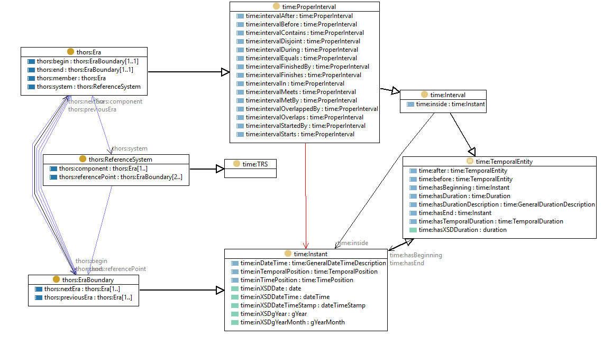

# Temporal Hierarchical Ordinal Reference System model
Markdown documentation created by [pyLODE](http://github.com/rdflib/pyLODE)

## Metadata
* **IRI**
  * `http://resource.geosciml.org/ontology/timescale/thors`
* **Creators(s)**
  * <a href='https://orcid.org/0000-0002-3884-3420'>Simon Jonathan David COX, CSIRO Australia</a>
* **Created**
  * 2011-01-01
* **Modified**
  * 2017-04-28
* **Imports**
  * <a href="http://purl.org/dc/elements/1.1/">dc:</a>
* **License &amp; Rights**
  * <a href="https://creativecommons.org/licenses/by/4.0/">https://creativecommons.org/licenses/by/4.0/</a>
  * &copy; © 2012-2017 CSIRO
* **Ontology Source**
  * <a href="./rdf/thors.ttl">RDF (turtle)</a>
* **Code Repository**
  * <https://github.com/CGI-IUGS/timescale-ont>
### Description

An OWL representation of the model for Temporal Hierarchical Ordinal Reference Systems defined in GeoSciML v3, and modeled after ISO 19108. 

The THORS ontology introduces the classes thors:Era and thors:eraBoundary which are elements in a thors:ReferenceSystem. 

The temporal positions of boundaries, and topological relationships between Eras may be encoded using <a href='https://www.w3.org/TR/owl-time/'>OWL-Time</a>.

## Table of Contents
1. [Classes](#classes)
1. [Object Properties](#objectproperties)
1. [Datatype Properties](#datatypeproperties)
1. [Namespaces](#namespaces)  

## Overview

**Figure 1:** Ontology overview  
## Classes
[Hierarchical Time Ordinal Reference System](#HierarchicalTimeOrdinalReferenceSystem),
[Time Ordinal Era Boundary](#TimeOrdinalEraBoundary),
[Time Ordinal Era or Interval](#TimeOrdinalEraorInterval),
### Time Ordinal Era or Interval c
Property | Value
--- | ---
IRI | `http://resource.geosciml.org/ontology/timescale/thors#Era`
Description | A temporal era is a named or identified interval from a temporal ordinal reference system
Super-classes |<a href="http://www.w3.org/2004/02/skos/core#Concept">skos:Concept</a>c 
Restrictions |<a href="#eraend">thors:end</a>op exactly 1 <a href="#erabeginning">thors:begin</a>op exactly 1 
In domain of |<a href="#erabeginning">thors:begin</a>op <a href="#eramember/sub-era">thors:member</a>op <a href="#system">thors:system</a>op <a href="#eraend">thors:end</a>op 
In range of |<a href="#nextera">thors:nextEra</a>op <a href="#previousera">thors:previousEra</a>op <a href="#eramember/sub-era">thors:member</a>op <a href="#temporalreferencesystemcomponent">thors:component</a>op 
### Time Ordinal Era Boundary c
Property | Value
--- | ---
IRI | `http://resource.geosciml.org/ontology/timescale/thors#EraBoundary`
Description | A temporal era boundary starts or ends a named or identified interval from a temporal ordinal reference system
Super-classes |<a href="http://www.w3.org/2004/02/skos/core#Concept">skos:Concept</a>c 
Restrictions |<a href="#nextera">thors:nextEra</a>op min 1 <a href="#previousera">thors:previousEra</a>op min 1 
In domain of |<a href="#nextera">thors:nextEra</a>op <a href="#previousera">thors:previousEra</a>op 
In range of |<a href="#erabeginning">thors:begin</a>op <a href="#referencepointintimescale">thors:referencePoint</a>op <a href="#eraend">thors:end</a>op 
### Hierarchical Time Ordinal Reference System c
Property | Value
--- | ---
IRI | `http://resource.geosciml.org/ontology/timescale/thors#ReferenceSystem`
Description | A temporal ordinal reference system is a constrained temporal topological complex, in which the edges are called 'eras'. Each era may be subdivided into one set of eras of the next finer rank. This constraint is required to establish a mono-hierarchy, so that a set of temporal positions defined relative to the reference system may be uniquely ordered.
Super-classes |<a href="http://www.w3.org/2004/02/skos/core#ConceptScheme">skos:ConceptScheme</a>c 
Restrictions |<a href="#temporalreferencesystemcomponent">thors:component</a>op min 1 <a href="#referencepointintimescale">thors:referencePoint</a>op min 2 
In domain of |<a href="#referencepointintimescale">thors:referencePoint</a>op <a href="#temporalreferencesystemcomponent">thors:component</a>op 
In range of |<a href="#system">thors:system</a>op 

## Object Properties
[era beginning](erabeginning),
[temporal reference system component](temporalreferencesystemcomponent),
[era end](eraend),
[era member / sub-era](eramember/sub-era),
[next era](nextera),
[previous era](previousera),
[reference point in timescale](referencepointintimescale),
[system](system),

### era beginning op
Property | Value
--- | ---
IRI | `http://resource.geosciml.org/ontology/timescale/thors#begin`
Super-properties |<a href="http://www.w3.org/2004/02/skos/core#semanticRelation">skos:semanticRelation</a> 
Domain(s) |<a href="#TimeOrdinalEraorInterval">thors:Era</a>c 
Range(s) |<a href="#TimeOrdinalEraBoundary">thors:EraBoundary</a>c 

### temporal reference system component op
Property | Value
--- | ---
IRI | `http://resource.geosciml.org/ontology/timescale/thors#component`
Super-properties |<a href="http://www.w3.org/2004/02/skos/core#hasTopConcept">skos:hasTopConcept</a> 
Domain(s) |<a href="#HierarchicalTimeOrdinalReferenceSystem">thors:ReferenceSystem</a>c 
Range(s) |<a href="#TimeOrdinalEraorInterval">thors:Era</a>c 

### era end op
Property | Value
--- | ---
IRI | `http://resource.geosciml.org/ontology/timescale/thors#end`
Super-properties |<a href="http://www.w3.org/2004/02/skos/core#semanticRelation">skos:semanticRelation</a> 
Domain(s) |<a href="#TimeOrdinalEraorInterval">thors:Era</a>c 
Range(s) |<a href="#TimeOrdinalEraBoundary">thors:EraBoundary</a>c 

### era member / sub-era op
Property | Value
--- | ---
IRI | `http://resource.geosciml.org/ontology/timescale/thors#member`
Super-properties |<a href="http://www.w3.org/2004/02/skos/core#narrower">skos:narrower</a> 
Domain(s) |<a href="#TimeOrdinalEraorInterval">thors:Era</a>c 
Range(s) |<a href="#TimeOrdinalEraorInterval">thors:Era</a>c 

### next era op
Property | Value
--- | ---
IRI | `http://resource.geosciml.org/ontology/timescale/thors#nextEra`
Super-properties |<a href="http://www.w3.org/2004/02/skos/core#semanticRelation">skos:semanticRelation</a> 
Domain(s) |<a href="#TimeOrdinalEraBoundary">thors:EraBoundary</a>c 
Range(s) |<a href="#TimeOrdinalEraorInterval">thors:Era</a>c 

### previous era op
Property | Value
--- | ---
IRI | `http://resource.geosciml.org/ontology/timescale/thors#previousEra`
Super-properties |<a href="http://www.w3.org/2004/02/skos/core#semanticRelation">skos:semanticRelation</a> 
Domain(s) |<a href="#TimeOrdinalEraBoundary">thors:EraBoundary</a>c 
Range(s) |<a href="#TimeOrdinalEraorInterval">thors:Era</a>c 

### reference point in timescale op
Property | Value
--- | ---
IRI | `http://resource.geosciml.org/ontology/timescale/thors#referencePoint`
Super-properties |<a href="http://www.w3.org/2004/02/skos/core#hasTopConcept">skos:hasTopConcept</a> 
Domain(s) |<a href="#HierarchicalTimeOrdinalReferenceSystem">thors:ReferenceSystem</a>c 
Range(s) |<a href="#TimeOrdinalEraBoundary">thors:EraBoundary</a>c 

### system op
Property | Value
--- | ---
IRI | `http://resource.geosciml.org/ontology/timescale/thors#system`
Description | reference system that this era belongs to
Super-properties |<a href="http://www.w3.org/2004/02/skos/core#topConceptOf">skos:topConceptOf</a> 
Domain(s) |<a href="#TimeOrdinalEraorInterval">thors:Era</a>c 
Range(s) |<a href="#HierarchicalTimeOrdinalReferenceSystem">thors:ReferenceSystem</a>c 

## Datatype Properties
[uncertainty in temporal position](uncertaintyintemporalposition),

### uncertainty in temporal position dp
Property | Value
--- | ---
IRI | `http://resource.geosciml.org/ontology/timescale/thors#positionalUncertainty`

## Namespaces
* **default (:)**
  * `http://resource.geosciml.org/ontology/timescale/thors#`
* **dc**
  * `http://purl.org/dc/elements/1.1/`
* **dcterms**
  * `http://purl.org/dc/terms/`
* **doap**
  * `http://usefulinc.com/ns/doap#`
* **owl**
  * `http://www.w3.org/2002/07/owl#`
* **prov**
  * `http://www.w3.org/ns/prov#`
* **rdf**
  * `http://www.w3.org/1999/02/22-rdf-syntax-ns#`
* **rdfs**
  * `http://www.w3.org/2000/01/rdf-schema#`
* **skos**
  * `http://www.w3.org/2004/02/skos/core#`
* **thors**
  * `http://resource.geosciml.org/ontology/timescale/thors#`
* **vann**
  * `http://purl.org/vocab/vann/`
* **voaf**
  * `http://purl.org/vocommons/voaf#`
* **xml**
  * `http://www.w3.org/XML/1998/namespace`
* **xsd**
  * `http://www.w3.org/2001/XMLSchema#`

## Legend
* Classes: c
* Object Properties :op
* Functional Properties: fp
* Data Properties: dp
* Annotation Properties: dp
* Properties: p
* Named Individuals: ni